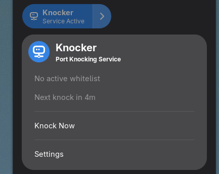

# Knocker GNOME Extension

A GNOME Shell extension for managing the [Knocker-CLI](https://github.com/FarisZR/Knocker-CLI) port knocking service.



## Quick Start

👉 **New to Knocker?** Check out the [Quick Start Guide](docs/QUICKSTART.md) to get up and running in 5 minutes!

## Features

- **Quick Settings Integration**: Easily toggle the knocker service on/off from the GNOME Quick Settings panel
- **Service Status**: Visual indicator showing when the knocker service is active (blue when on, gray when off)
- **Manual Knock Trigger**: Trigger a knock manually with a single click
- **Real-time Status**: View current whitelisted IP and expiry time
- **Upcoming Knock**: See when the next automatic knock is scheduled
- **Error Notifications**: Get notified when the service encounters errors
- **Auto-start**: Optionally auto-start the service when the extension loads

## Requirements

- GNOME Shell 48 or 49
- [Knocker-CLI](https://github.com/FarisZR/Knocker-CLI) installed and configured
- systemd user service `knocker.service` set up

## Installation

### From Source

1. Clone this repository:
   ```bash
   git clone https://github.com/FarisZR/knocker-gnome.git
   cd knocker-gnome
   ```

2. Install the extension:
   ```bash
   mkdir -p ~/.local/share/gnome-shell/extensions/Knocker@fariszr.com
   cp -r . ~/.local/share/gnome-shell/extensions/Knocker@fariszr.com/
   ```

3. Compile the GSettings schema:
   ```bash
   cd ~/.local/share/gnome-shell/extensions/Knocker@fariszr.com
   glib-compile-schemas schemas/
   ```

4. Enable the extension:
   ```bash
   gnome-extensions enable Knocker@fariszr.com
   ```

5. Restart GNOME Shell:
   - On X11: Press `Alt+F2`, type `r`, and press Enter
   - On Wayland: Log out and log back in

## Usage

### Quick Settings

After installation, you'll find the Knocker toggle in your Quick Settings panel (top-right corner):

- **Toggle Switch**: Start/stop the knocker service
- **Current IP**: Shows the currently whitelisted IP and when it expires
- **Next Knock**: Shows when the next automatic knock is scheduled
- **Knock Now**: Manually trigger a knock
- **Settings**: Open the preferences window

### Service States

- **Blue Toggle**: Service is running
- **Gray Toggle**: Service is stopped

### Notifications

The extension will show notifications for:
- Successful knocks (when enabled in settings)
- Service errors (when enabled in settings)
- Missing knocker-cli installation

## Configuration

Open the extension preferences to configure:

- **Show Indicator**: Display the Knocker icon in the panel
- **Auto-start Service**: Automatically start the service when the extension loads
- **Notify on Errors**: Show notifications for service errors
- **Notify on Successful Knock**: Show notifications when a knock succeeds

## Troubleshooting

### Extension doesn't appear

1. Check if the extension is enabled:
   ```bash
   gnome-extensions list
   ```

2. Check for errors in the logs:
   ```bash
   journalctl -f -o cat /usr/bin/gnome-shell
   ```

### Service won't start

1. Check if knocker-cli is installed:
   ```bash
   which knocker
   ```

2. Check if the knocker.service is configured:
   ```bash
   systemctl --user status knocker.service
   ```

3. Check service logs:
   ```bash
   journalctl --user -u knocker.service
   ```

## Development

See [docs/ARCHITECTURE.md](docs/ARCHITECTURE.md) for development documentation.

## License

This extension is licensed under the GPL-2.0-or-later license. See the source files for details.

## Contributing

Contributions are welcome! See [CONTRIBUTING.md](CONTRIBUTING.md) for guidelines.

## Documentation

- [Quick Start Guide](docs/QUICKSTART.md) - Get started in 5 minutes
- [Installation Guide](docs/INSTALLATION.md) - Detailed installation instructions  
- [Testing Guide](docs/TESTING.md) - Comprehensive testing procedures
- [Architecture Guide](docs/ARCHITECTURE.md) - Technical design details
- [Development Guide](docs/DEVELOPMENT.md) - For contributors
- [Publishing Guide](docs/PUBLISHING.md) - Submission to extensions.gnome.org

## Credits

- Based on the [GJS Guide](https://gitlab.gnome.org/World/javascript/gjs-guide)
- Integrates with [Knocker-CLI](https://github.com/FarisZR/Knocker-CLI) by FarisZR
